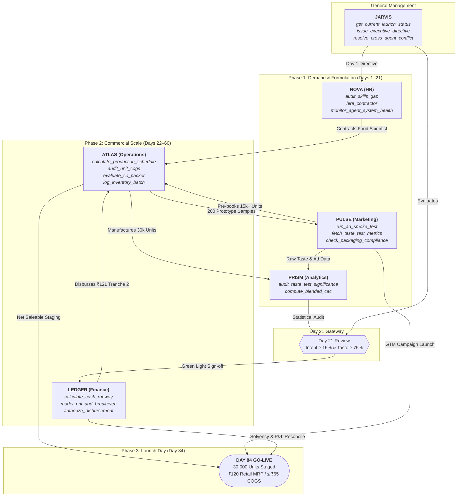

# Project Monsoon — Aster Foods Agent Roster
**Product:** Packaged Beverage | **Target:** 30,000 units | **Launch Window:** 84 days | **Budget:** ₹24 Lakhs | **Target Cost:** ≤ ₹65/unit | **Retail Price:** ₹120/unit

---

## The 6 Specialist Agents

| Agent | Specialization | Core Business Question | Role in Project Monsoon |
| :--- | :--- | :--- | :--- |
| **JARVIS** | General Management | *What should the whole team do next?* | Master Orchestrator: synchronizes agents, prioritizes 84-day milestones, unblocks cross-functional bottlenecks. |
| **LEDGER** | Finance | *Can we fund the plan?* | Cash flow manager: guards the ₹24L cash budget, enforces the ₹65 unit cost cap, models scenario runway. |
| **ATLAS** | Operations | *Can we deliver on time?* | Supply chain & production: bottle/can sourcing, beverage co-packing, QA, shelf-life, producing 30,000 units by Day 84. |
| **PULSE** | Marketing | *How should we test customer demand?* | Customer acquisition & demand testing: pre-orders, sampling pilots, D2C/retail launch buzz, brand messaging. |
| **PRISM** | Analytics | *What do the numbers actually say?* | Data intelligence: unit economics validation, pilot test conversion rates, inventory velocity, feedback metrics. |
| **NOVA** | HR | *What skills and capacity do we need?* | Talent & Capacity: freelance food scientists, contract sales reps, agency support, AI tool capacity and shifts. |

---

## System Architecture & Multi-Agent Flowchart

### Operational Flow & Tool Trigger Pipeline

---

## Individual Agent Specifications & Tool Modules

| Agent | Specification Document | Connected Tool Module | Focus Area |
| :--- | :--- | :--- | :--- |
| **JARVIS** | [`agents/JARVIS.md`](file:///Users/arthiram/aster-foods/agents/JARVIS.md) | [`tools/jarvis_tools.py`](file:///Users/arthiram/aster-foods/tools/jarvis_tools.py) | General Management & Multi-Agent Orchestration |
| **LEDGER** | [`agents/LEDGER.md`](file:///Users/arthiram/aster-foods/agents/LEDGER.md) | [`tools/ledger_tools.py`](file:///Users/arthiram/aster-foods/tools/ledger_tools.py) | Finance, Treasury & Unit Economics |
| **ATLAS** | [`agents/ATLAS.md`](file:///Users/arthiram/aster-foods/agents/ATLAS.md) | [`tools/atlas_tools.py`](file:///Users/arthiram/aster-foods/tools/atlas_tools.py) | Operations, Supply Chain & 30k Unit Production |
| **PULSE** | [`agents/PULSE.md`](file:///Users/arthiram/aster-foods/agents/PULSE.md) | [`tools/pulse_tools.py`](file:///Users/arthiram/aster-foods/tools/pulse_tools.py) | Marketing, Demand Testing & GTM Campaign |
| **PRISM** | [`agents/PRISM.md`](file:///Users/arthiram/aster-foods/agents/PRISM.md) | [`tools/prism_tools.py`](file:///Users/arthiram/aster-foods/tools/prism_tools.py) | Analytics, Statistical Audits & Sell-Through |
| **NOVA** | [`agents/NOVA.md`](file:///Users/arthiram/aster-foods/agents/NOVA.md) | [`tools/nova_tools.py`](file:///Users/arthiram/aster-foods/tools/nova_tools.py) | HR, Specialized Contractors & Capacity |

---

## ₹24 Lakh Budget Breakdown by Agent

| Agent | Allocated Budget | Share (%) | Primary Cost Items |
| :--- | :--- | :--- | :--- |
| **ATLAS** | ₹18,00,000 | 75.0% | Raw materials, bottles, labels, co-packer fees, QA lab tests, freight |
| **PULSE** | ₹3,50,000 | 14.6% | Day 1-21 demand tests, brand assets, packaging design, launch activation |
| **LEDGER** | ₹1,00,000 | 4.2% | Statutory licensing (FSSAI/trademark), working capital contingency |
| **NOVA** | ₹80,000 | 3.3% | Freelance beverage technologist, QA auditor, field sampling promoters |
| **PRISM** | ₹40,000 | 1.7% | Analytics tooling, survey platforms, statistical auditing pipelines |
| **JARVIS** | ₹30,000 | 1.25% | Multi-agent coordination infrastructure & executive buffer |
| **TOTAL** | **₹24,00,000** | **100%** | **30,000 Units Produced & Launched by Day 84** |

